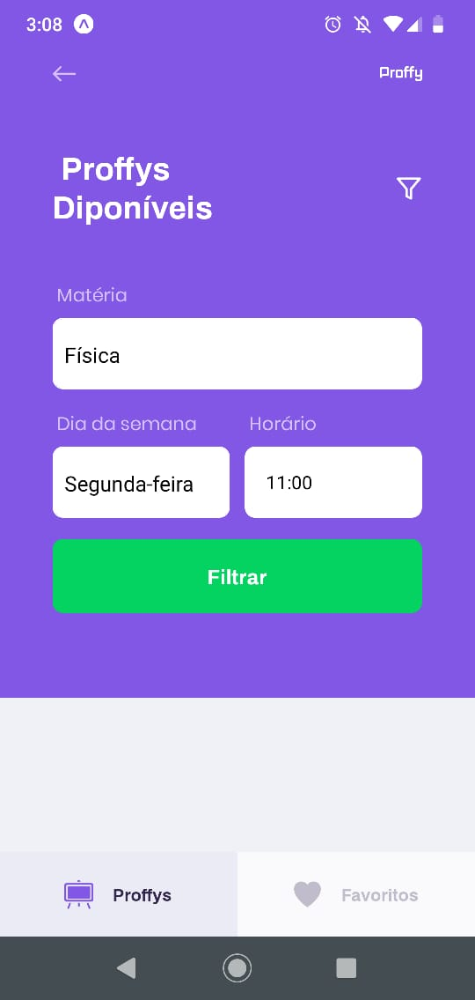

<strong>Proffy</strong> - mobile desenvolvido na next-level-week-2 da rocketseat.

- Para rodar o projeto você precisará ter um celular com o
    <a target="_blank" href="https://play.google.com/store/apps/details?id=host.exp.exponent"> expo </a> instalado ou um emulador android/ios. Siga os passos para executar o app.

```bash
# Clone este repositório
$ git clone git@github.com:ridneto/nlw2-mobile.git

# Acesse a pasta do projeto no terminal/cmd
$ cd nlw2-mobile

# Instale as dependências
$ yarn install

# Execute a aplicação a aplicação
$ yarn start
```

Após isso, leia o QRCode com o app expo ou rode no emulador.

Importante que tenha o <a target="_blank" href="https://github.com/ridneto/nlw2-mobile">backend</a> rodando na máquina.

Tela entrada 


Tela consulta aulas




Tela favoritos


Modulo de cadastro aula. f


